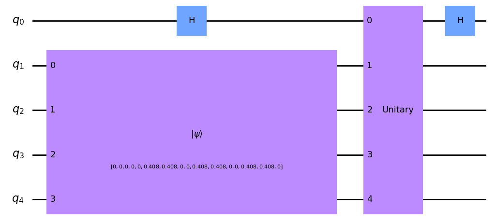
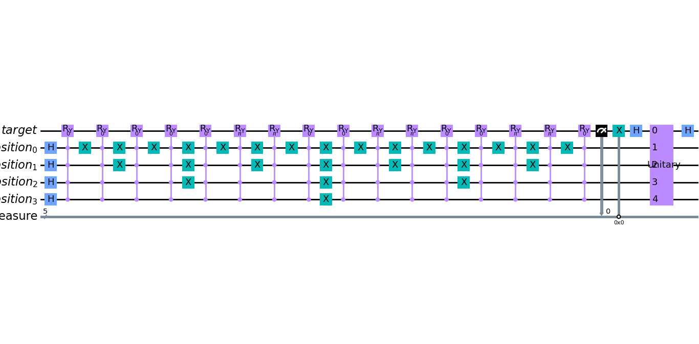

<div align="center">
 
 
 
 
 
 
 
 
 
 
</div>

---
Quantum Edge Detection using different Quantum Encoding strategies which include Flexible Representation of Quantum Images (FRQI), Novel Enhanced Quantum Representation (NEQR) and Quantum Probabilty Image Encoding (QPIE) along with a modified Quantum Hadamard Edge Detection (QHED) Algorithm. It is also my 7th semester project for the course CS4084 Quantum Computing.

## Table of Contents

- [Installation](#installation)
- [Usage](#usage)
- [Features](#features)
- [Credits](#credits)

## Installation

1. Clone the repository:
```bash
 git clone https://github.com/mohammadyehya/Quantum_Edge_Detection.git
```

2. If using python version then first setup and activate your virtual environment
```bash
 python -m venv venv
 venv\Scripts\activate.bat
```
3. Install dependencies:
```bash
 pip install -r requirements.txt
 ```

## Usage
1. If using notebook version then run cells as is. (Recommended)
2. For python version, the code is written in `main.py`, and simply run `python main.py` to execute the file. (Not recommended as there are some bugs for this version)
---

## Features

The main features of the project are the encoding strategies. There are 3 functional classes, the BaseEncoding class, QPIE class, & FRQI class. 

The QPIE class has the encode function which takes an image and encodes it onto a Quantum circuit as shown below.



The FRQI class is more complicated and requires a chain of CRy gates for each pixel as shown below.



For comparision against classical methods, you can use the Sobel Edge Detection method which is located in the `sobel.py` file. Also, a utility function was created for fast comparision between images which can be found in `utils.py`.

## How to Contribute
Contributions are welcome! Please open an issue or submit a pull request with your changes.

<!-- >

## License
Distributed under the AGPLv3 License. See LICENSE for more information.

< -->

## Credits
### Collaborators

<a href="https://github.com/mohammadyehya/Quantum_Edge_Detection/graphs/contributors">
  
</a>

### References

[EDGE DETECTION QUANTUMIZED: A NOVEL QUANTUM ALGORITHM FOR IMAGE PROCESSING](https://arxiv.org/pdf/2404.06889)

[Quantum Image Processing](https://arxiv.org/pdf/2203.01831)

[Quantum Image Processing and Its Application to Edge Detection: Theory and Experiment](https://arxiv.org/pdf/1801.01465)

[Quantum Image Processing: Quantum Probability Image Encoding (QPIE) and Quantum Hadamard Edge Detection](https://medium.com/mit-6-s089-intro-to-quantum-computing/quantum-image-processing-quantum-probability-image-encoding-qpie-and-quantum-hadamard-edge-df7bd3dc7f8)
